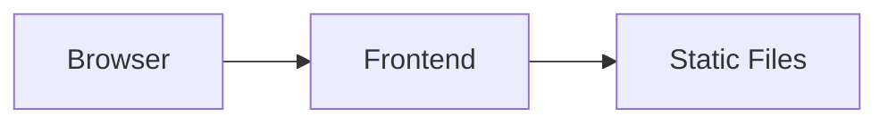

## 1. Architecture Design


## 2. Technology Description
- Frontend: React@18 + tailwindcss@3 + vite
- Initialization Tool: vite-init
- Backend: None (纯静态简历页面)
- Database: None

## 3. Route Definitions
| Route | Purpose |
|-------|---------|
| / | 首页简历展示页面 |

## 4. API Definitions
无后端API，纯静态展示

## 5. Data Model
无数据库，简历数据通过组件内state管理

## 6. Project Structure
```
src/
├── components/
│   ├── Header.tsx          # 个人信息头部
│   ├── Skills.tsx          # 专业技能组件
│   ├── Education.tsx       # 教育背景组件
│   ├── Experience.tsx      # 实习经历组件
│   ├── Projects.tsx        # 项目经历组件
│   ├── Awards.tsx          # 获奖情况组件
│   └── SelfAssessment.tsx  # 自我评价组件
├── App.tsx                 # 主应用组件
├── main.tsx                # 入口文件
└── index.css               # 全局样式
```

## 7. Design Assets
- 证件照：用户提供的照片
- 图标：lucide-react 图标库